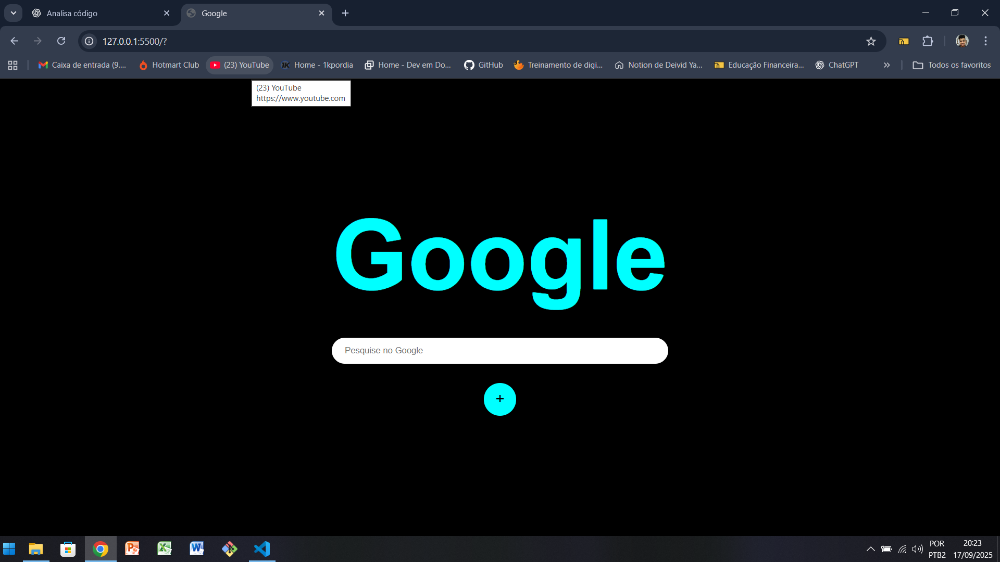

# Projeto Página Google Fake

Este projeto é uma reprodução simples da página inicial do Google, feita com **HTML e CSS**. Tem como objetivo utilizar a interface como treinamento de hipertexto e estilização.

## 🚀 Tecnologias usadas
- HTML5
- CSS3 

## 📷 Imagem

## Conclusão
Pratiquei minhas habilidades de HTML e CSS recriando a ineterface do Google, obtive muitas dúvidas como centralizar alguns itens, impor algumas classes nas tag's e faltou semântica no meu código. Utilizando o ChatGPT como orientador, analisei os pontos a serem corrigidos e apliquei. Todos meus repositórios são formas de treinamento que venho estudando há algum tempo, estou aberto a qualquer informação que possa agregar nas minhas habilidades e racicínio como um desenvolverdor!

